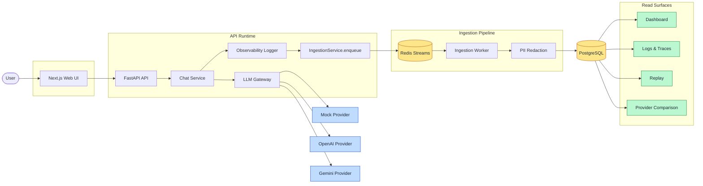
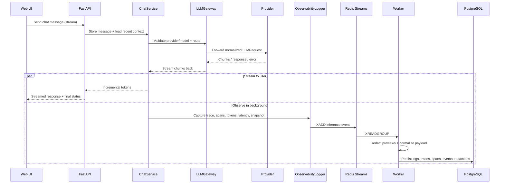
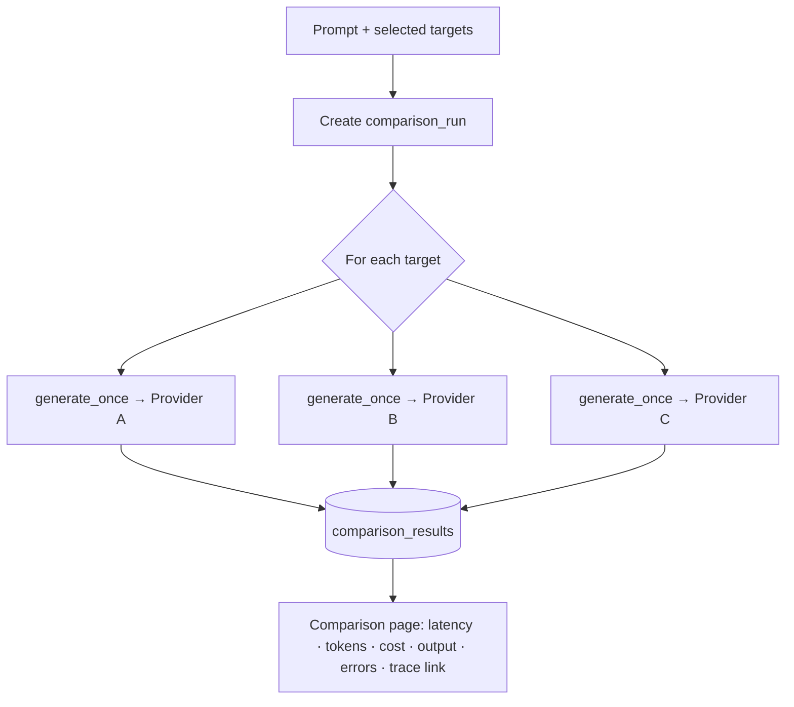

<div align="center">

# 🔭 InferLens

**A full-stack LLM observability platform** — trace, replay, and compare inference calls across providers.

[](https://nextjs.org/)
[](https://www.typescriptlang.org/)
[](https://fastapi.tiangolo.com/)
[](https://www.postgresql.org/)
[](https://redis.io/docs/data-types/streams/)
[](https://docs.docker.com/compose/)

</div>

There's a chatbot to generate model traffic, but the core project is the infrastructure around it: gateway routing, inference logging, Redis-based ingestion, Postgres persistence, dashboards, trace replay, provider comparison, and PII-safe observability.

> **Most teams can build a chatbot before they can explain what happened inside a single LLM call.** InferLens answers: which provider/model handled it, how long it took, how many tokens it used, whether it streamed/failed/cancelled, what context was sent, whether sensitive data was redacted, whether it can be replayed, and how providers compare on latency, cost, and failures.

---

## ✨ Features

- Multi-turn chatbot with short context window, streaming (`fetch()` + `ReadableStream`), and mid-generation cancel
- Provider-agnostic LLM gateway with **Mock / OpenAI / Gemini** adapters and provider/model validation
- Inference logs with latency, tokens, cost, status, and errors
- Redis Streams ingestion + background worker with retry / dead-letter handling
- PostgreSQL storage for messages, traces, logs, spans, stream events, and comparisons
- PII redaction for observability previews
- Dashboard (requests, latency, errors, cancellations, tokens, cost, provider usage)
- Trace detail with spans, stream events, redactions, provider errors, and replay history
- Replay from safe request snapshots + provider comparison across configured models
- One-command Docker Compose setup

---

## 🏗️ Architecture



The request path stays simple: **UI → API → gateway → provider**. Everything observable forks off through the **Observability Logger**, gets enqueued to Redis, and is persisted asynchronously by the worker (after redaction) so logging never blocks the user's response.

---

## 🔁 Inference Flow

End-to-end path of a single chat message, from keystroke to persisted trace:



---

## ▶️ Replay Flow

Replay rebuilds a request from `request_snapshot_json` — which holds only **replay-safe** inputs. Secrets, auth headers, and raw API keys are never stored there.

```mermaid
flowchart LR
    T[Trace Page] -->|POST /api/traces/:id/replay| RS[ReplayService]
    RS --> SNAP[Load request_snapshot_json]
    SNAP --> MUT[Apply replay options]
    MUT --> GEN[ChatService.generate_once]
    GEN --> GW[LLM Gateway] --> P[Provider]
    P --> LOG[Observability Logger] --> Q[Ingestion]
    Q --> WK[Worker persistence]
    WK --> NEW[New trace + log rows]
    NEW --> T2[Replay result in trace UI]

    classDef safe fill:#bbf7d0,stroke:#15803d,color:#1f2937;
    class SNAP,NEW safe;
```



---

## ⚖️ Provider Comparison Flow

Comparison reuses the same gateway and logging stack — no separate evaluation engine. Each target gets **its own trace and log**.



> No quality ranking, LLM-as-judge, or benchmark scoring is included.

---

## 🧰 Tech Stack

| Layer | Technologies |
|---|---|
| **Frontend** | Next.js (App Router), TypeScript, Tailwind CSS, Recharts |
| **Backend** | FastAPI, Pydantic, SQLAlchemy, Alembic, Uvicorn |
| **Infra** | PostgreSQL, Redis Streams, Docker Compose |
| **Providers** | Mock, OpenAI, Gemini |

---

## 🖥️ Core Pages

| Page | Purpose |
|---|---|
| `/chat` | Generate inference traffic |
| `/dashboard` | Aggregate latency, token, cost, error, and provider metrics |
| `/logs` | Inspect every inference request |
| `/traces/[traceId]` | Debug one request lifecycle |
| `/comparisons` | Compare provider/model performance |
| `/settings/providers` | View configured provider models |

---

## 🚀 Quick Start

```bash
cp .env.example .env          # PowerShell: Copy-Item .env.example .env
docker compose up --build
```

Open:

- **Web:** http://localhost:3000/chat
- **API health:** http://localhost:8000/health

Compose starts `web`, `api`, `worker`, `postgres`, and `redis`. Don't commit `.env`.

---

## 🧪 Mock Mode

Runs the **entire pipeline without real keys** — still creates logs, traces, dashboard metrics, replays, comparisons, stream events, and redaction records.

```env
LLM_MOCK_MODE=true
DEFAULT_PROVIDER=mock
DEFAULT_MODEL=mock-fast
```

| Model | Purpose |
|---|---|
| `mock-fast` | Fast successful response |
| `mock-slow` | Slow streaming response (cancellation testing) |
| `mock-error` | Simulated provider error |

To use real providers, add `OPENAI_API_KEY` / `GEMINI_API_KEY` to root `.env`, set `LLM_MOCK_MODE=false`, and pick the provider in the UI. Keys are backend-only and never exposed to the frontend.

---

## 🔒 Security & Reliability

- PII redaction (emails, phone numbers, API-key-like strings, JWT-like tokens, credit-card-like patterns) on observability previews
- API keys never stored in request snapshots; headers, cookies, and bearer tokens never persisted
- Provider error messages sanitized before display; canonical chat content kept separate from redacted previews
- Failures normalized and visible in traces: invalid provider/model, missing key, rate limit, model not found, server error, invalid request, cancellation, worker persistence failure
- Ingestion is idempotent by `event_id`; repeated worker failures move to dead-letter storage

---

<div align="center">
<sub>MIT Licensed</sub>
</div>